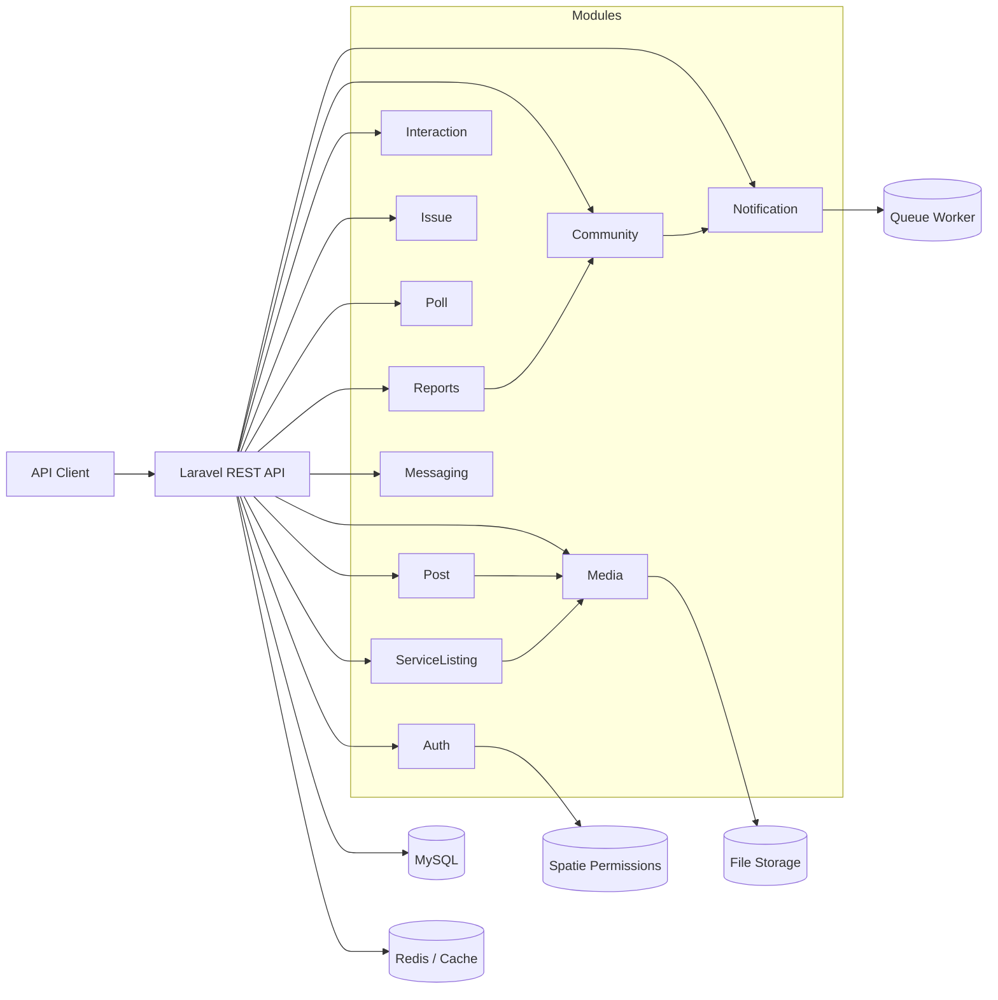
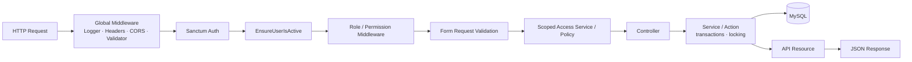
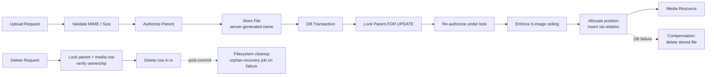
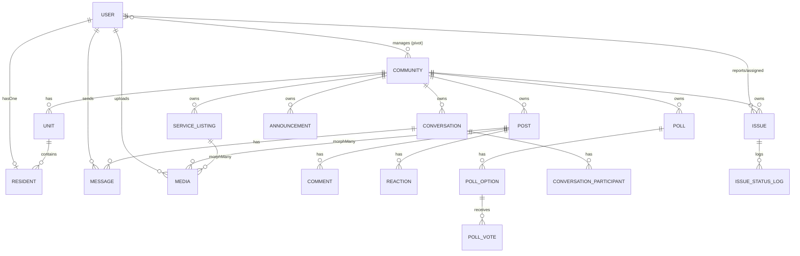

<h1 align="center">NeighborHub</h1>
<h3 align="center">Secure Modular Backend for Community Management</h3>
<h4 align="center">A Laravel 12 modular-monolith REST API</h4>

<p align="center">
  <a href="https://laravel.com"></a>
  <a href="https://www.php.net/"></a>
  <a href="#"></a>
  <a href="#"></a>
  <a href="#"></a>
  <a href="#"></a>
  <a href="#"></a>
  <a href="#"></a>
  <a href="#"></a>
</p>

---

NeighborHub is a **backend REST API** for managing residential communities: the people who live and work in them, the conversations they have, the issues they report, and the services they offer one another. It targets community administrators, managers, residents, and local service providers through a single role-aware API.

It exists to solve a real coordination problem — scattered chats, lost maintenance requests, opaque administration — by modeling community membership, identity, authorization, and cross-cutting domains (posts, polls, issues, listings, private messaging, media, notifications, and reporting) as one coherent, community-scoped backend.

This repository is **backend-only**. There is no frontend application; every capability is exposed through versioned JSON endpoints.

---

## Table of Contents

- [The Problem](#the-problem)
- [Platform Overview](#platform-overview)
- [Core Capabilities](#core-capabilities)
- [Architecture](#architecture)
  - [System Architecture](#system-architecture)
  - [Request Lifecycle](#request-lifecycle)
  - [Modules](#modules)
- [Engineering Highlights](#engineering-highlights)
- [Security Architecture](#security-architecture)
- [Community Isolation Model](#community-isolation-model)
- [Media Security Pipeline](#media-security-pipeline)
- [Messaging Design](#messaging-design)
- [API Design](#api-design)
- [API Examples](#api-examples)
- [API Documentation](#api-documentation)
- [Data Model](#data-model)
- [Concurrency & Data Integrity](#concurrency--data-integrity)
- [Testing Strategy](#testing-strategy)
- [Performance Engineering](#performance-engineering)
- [Redis & Caching](#redis--caching)
- [Project Structure](#project-structure)
- [Local Development Setup](#local-development-setup)
- [Running Tests](#running-tests)
- [Useful Commands](#useful-commands)
- [Environment Configuration](#environment-configuration)
- [Current Engineering Status](#current-engineering-status)
- [Graduation Project](#graduation-project)
- [Team](#team)
- [Documentation](#documentation)
- [License](#license)

---

## The Problem

Managing a residential community today is fragmented. Announcements live in one group chat, maintenance requests in another, service recommendations in a third, and polls rarely reach everyone affected. Residents have no single place to raise and track issues; managers have no consistent way to assign, update, and report on them; service providers have no trusted, community-scoped surface to advertise what they offer. The result is lost information, duplicated work, and weak accountability.

NeighborHub addresses this by consolidating community administration into **one role-aware backend** with a shared notion of membership and identity. Every post, issue, poll, listing, conversation, and media object belongs to a community and is authorized against the actor's relationship to that community.

---

## Platform Overview

NeighborHub models four user roles, defined as a strict enum (`Modules/Auth/app/Enums/UserRole.php`) and mirrored onto Spatie RBAC roles.

| Role | Key responsibility |
| --- | --- |
| **Super Administrator** (`super_admin`) | Platform-wide administration. Assigns user roles, manages communities, and can demote other super-admins under concurrency-safe guards. |
| **Community Manager** (`manager`) | Runs one or more communities: approves/suspends residents, posts announcements, manages polls, assigns and updates issues, and views community reports. |
| **Resident** (`resident`) | Belongs to a community (optionally a unit). Creates posts, comments, reactions, issues, and service listings; participates in polls and conversations. |
| **Service Provider** (`provider`) | A community actor focused on the service-listings and issue-fulfillment workflows (e.g. accepting issue assignments and status updates). |

Roles are enforced through a combination of **Spatie permissions** (`can:` middleware), **custom role middleware** (`managerOrSuperAdmin`, `managerSuperAdminOrProvider`, `residentOfCommunity`), **policies**, and **scoped access services**.

---

## Core Capabilities

**Community Management** — Communities, units, residents, and community managers form the membership backbone. Residents request to join; managers approve, reject, or suspend them. A resident's residency is tracked with a `current_marker` and a status lifecycle.

**Resident Engagement** — Authored posts (categorized: general, lost & found, question, event, recommendation), threaded comments, reactions, and manager-published announcements. Announcements and posts are independently reactable.

**Issue Management** — Residents report issues against categories; managers assign them (including to providers), advance status, and append progress updates. Every status change is recorded in an immutable status log, exposing a full issue history.

**Polls** — Managers create community polls with discrete options; residents vote once. Polls move through an explicit lifecycle (activate / close), with results computed only when allowed.

**Local Service Listings** — Residents and providers publish community-scoped listings (`sale`, `rent`, `share`, `request`) with pricing and expiry, plus a managed status workflow.

**Private Messaging** — Community-scoped conversations between participants, with messages, a server-authoritative read cursor, and set-based unread counts.

**Secure Media Handling** — Polymorphic image attachments (posts, service listings) with a transactional, concurrency-safe upload/delete/reorder lifecycle and post-commit orphan cleanup.

**Notifications & Reporting** — In-app notifications generated from domain events, plus community-level manager reports (engagement, issues summary, providers, services activity).

---

## Architecture

NeighborHub is a **modular monolith**: a single Laravel application whose domains are isolated into **nwidart/laravel-modules** modules. Each module owns its models, migrations, HTTP layer (requests, controllers, resources), and services. Domains share the framework (auth, RBAC, database, cache) but are otherwise self-contained — giving the boundaries of a distributed system without its operational cost.

### System Architecture



### Request Lifecycle

A request flows through global middleware, authentication, route-level authorization, validation, and a thin controller that delegates to a service before serializing through an API Resource.



Not every endpoint uses every layer — for example, some modules authorize through Spatie `can:` middleware, others through custom role middleware or in-service ownership checks. The diagram describes the common path; authorization strategy is chosen per route from the available mechanisms.

### Modules

The active production surface is built from **11 enabled modules**. (`modules_statuses.json`.)

| Module | Responsibility |
| --- | --- |
| **Auth** | Registration, login, logout, password change, forgot/reset password, active-user enforcement, security logging, role assignment. |
| **Community** | Communities, units, residents, community managers, announcements, membership (approve/reject/suspend), community stats. |
| **Post** | Community posts with categories; serves as a media parent and engagement hub. |
| **Interaction** | Comments and reactions across posts and announcements. |
| **Issue** | Issues, issue categories, assignment, status transitions, progress updates, status log history, comments. |
| **Poll** | Community polls, options, single-vote enforcement, lifecycle (activate/close), results. |
| **ServiceListing** | Community service listings, status workflow, expiry; serves as a media parent. |
| **Messaging** | Community-scoped conversations, participants, messages, read cursor, unread counts. |
| **Media** | Polymorphic image attachments: concurrency-safe upload, reorder, delete, orphan cleanup. |
| **Notification** | In-app notifications and notification logs generated from domain events. |
| **Reports** | Manager/Super-Admin community analytics: engagement, issues summary, providers, services activity. |

> **Technical note.** An unused `Report` (singular) laravel-modules scaffold was removed from the repository; the live reporting surface is the `Reports` module. The default laravel-modules scaffold also generated placeholder CRUD routes (`interactions`, `messagings`, `posts`, `servicelistings`) that are scaffold artifacts and are **not** the real API surface.

---

## Engineering Highlights

**Modular monolith.** Domains are separated by module, each owning its migrations, models, services, and HTTP layer. This provides clear ownership and bounded contexts while keeping deployment a single artifact.

**Thin HTTP layer.** Request validation lives in dedicated **Form Requests**; controllers stay small and delegate to **Service** classes (e.g. `MediaService`, `MessageService`, `ConversationReadStateService`, `IssueService`, `PollService`, `ServiceListingService`); responses are shaped through **API Resources** so raw Eloquent models are never serialized to the client.

**Concurrency-aware operations.** Critical invariants are protected with `DB::transaction()` and `lockForUpdate()` — the media ceiling, conversation send/read serialization, and reorder uniqueness all rely on explicit row locking (see [Concurrency & Data Integrity](#concurrency--data-integrity)).

**Scoped authorization.** Community-owned data is resolved through route-scoped bindings and access services that tie an actor to a community and (for messaging) to an active participant row, rather than trusting client-supplied identifiers.

**Safe serialization.** Mass-assignment surfaces are deliberately narrow: on `User`, `role` and `is_active` are excluded from `$fillable`; media morph columns are written server-side through the relation, never from request data.

**Deterministic output.** List endpoints paginate, and derived aggregates (e.g. messaging unread counts) are computed in single set-based queries rather than per-row, keeping query counts stable as data grows.

---

## Security Architecture

Security was treated as a first-class engineering concern, with controls implemented across authentication, authorization, data exposure, and file handling. This is an academic project under active hardening; it is **not** claimed to be production-ready or free of vulnerabilities. Controls verified in the codebase:

| Area | Approach |
| --- | --- |
| Authentication | Laravel Sanctum bearer tokens (`auth:sanctum`) |
| Authorization | Spatie RBAC (guard pinned to `api`) + custom role middleware + policies + scoped access services |
| Active users | `EnsureUserIsActive` middleware rejects inactive accounts |
| Passwords | Bcrypt hashing; `password` hidden from output; strong validation on change |
| Privileged fields | `role` / `is_active` excluded from mass assignment |
| Abuse protection | Named rate limiters (e.g. send-message, security-log) |
| Observability | Dedicated security logger writing to a separate security log channel |
| File security | MIME / type / size validation, server-generated filenames, server-side morph columns |
| Concurrency | Transactions + `lockForUpdate()` on invariants (media ceiling, send/read, reorder) |
| Isolation | Community-scoped resolution; privacy-safe 404s that never disclose existence |

Examples of fail-closed design: media delete resolves the parent from stored morph state (never trusting a client-supplied type/id), and messaging operations scope `lockForUpdate` queries by `community_id` + active participation so a non-participant never locks an arbitrary private conversation.

---

## Community Isolation Model

Community-owned resources carry a `community_id` and are resolved **within the actor's community**. The model distinguishes two directions of membership:

- **Resource → Community** — a post, issue, poll, listing, conversation, or announcement belongs to exactly one community.
- **Actor → Community** — a resident is linked to a community through residency (and optionally a unit); a manager is linked through the `community_mangers` pivot; conversations additionally require an active participant row.

Access services and route bindings enforce that an actor can only touch resources inside communities they belong to. This is the intended isolation architecture; not every legacy endpoint has been brought fully under it yet (see [Current Engineering Status](#current-engineering-status)).

---

## Media Security Pipeline

The Media module attaches images to parents (posts, service listings) via a two-phase, parent-locked lifecycle. `MediaService::attach()` stores the file **outside** the transaction, then serializes on the parent row `FOR UPDATE` to re-authorize and enforce a per-parent ceiling (`MAX_PER_PARENT = 5`).



Key properties: a five-image-per-parent ceiling enforced under the lock; server-side morph columns (never mass-assigned); DB row deletion committed **before** filesystem deletion so an un-rollbackable file operation can never invalidate a row; and a dispatched `CleanupMediaFile` recovery job when post-commit file deletion fails. Reorder avoids transient unique-position collisions by moving every row into a scratch range before assigning final positions.

---

## Messaging Design

Messaging is community-scoped and built around three tables: `conversations`, `conversation_participants`, and `messages`.

- **Conversations** belong to a community; access is gated by an **active participant row** (`left_at IS NULL`) for the actor.
- **Messages** record `sender_id` and inherit `community_id`; legacy `is_read`/`read_at` columns are deliberately unused.
- **Read state** is a single server-authoritative `last_read_message_id` cursor on the participant row, advanced **monotonically** and only to a message the actor could see at/after their `joined_at` boundary.
- **Unread counts** are computed by one set-based query (`sender_id != self`, visible at/after `joined_at`, newer than the cursor), attached to every conversation on a list page — avoiding per-conversation counting.

Send and mark-read both serialize on the conversation row (`lockForUpdate`) scoped by community and active participation, so a concurrent leave can never race a write. A stored cursor pointing outside its conversation fails closed rather than being silently repaired.

---

## API Design

The API is JSON over HTTP, authenticated with **Sanctum bearer tokens**, and primarily versioned under **`/api/v1`**. Pagination uses Laravel's `LengthAwarePaginator`; responses are shaped through API Resources; validation lives in Form Requests.

### Convention (and known legacy exceptions)

| Surface | Prefix |
| --- | --- |
| Primary API (Auth, Community, Post, Interaction, Poll, ServiceListing, Messaging, Media) | `/api/v1/...` |
| Reports | `/api/communities/{communityId}/reports/*` (no `v1`) |
| Issues & Announcements | `/v1/communities/{communityId}/*` (no `api`) |

The bulk of the API follows `/api/v1`. The Issues/Announcements modules and the Reports module currently diverge on prefix segments — a known, tracked inconsistency rather than a hidden one. Verify exact paths with `php artisan route:list`.

---

## API Examples

All examples use a `Bearer` Sanctum token. Replace `<token>` and IDs with real values.

### Authentication — login

```http
POST /api/v1/auth/login
Content-Type: application/json

{
  "email": "user@example.com",
  "password": "your-password",
  "device_name": "cli"
}
```

```json
{
  "message": "Login successful.",
  "data": {
    "user": { "id": 1, "name": "Jane Resident", "email": "user@example.com", "role": "resident" },
    "access_token": "1|abcdef0123456789...",
    "token_type": "Bearer",
    "expires_at": "2026-08-21T00:00:00.000000Z"
  }
}
```

`device_name` is required because Sanctum tokens are scoped per device; an invalid credential pair returns `401`.

### List community posts

```http
GET /api/v1/communities/1/posts?page=1
Authorization: Bearer <token>
```

### Create a service listing

```http
POST /api/v1/communities/1/service-listings
Authorization: Bearer <token>
Content-Type: application/json

{
  "title": "Bicycle for rent",
  "description": "City bike, available weekends.",
  "type": "rent",
  "price": 15.00,
  "expires_at": "2026-09-01T00:00:00Z"
}
```

`type` must be one of `sale`, `rent`, `share`, `request`; `expires_at` must be a future date.

### Send a message

```http
POST /api/v1/communities/1/conversations/42/messages
Authorization: Bearer <token>
Content-Type: application/json

{
  "content": "Is the bicycle still available?"
}
```

---

## API Documentation

The API is documented in Postman. The current documentation set consists of exactly two files, committed under `docs/postman/`:

- **Primary Postman Collection** — [`docs/postman/NeighborHub.NEW.postman_collection.json`](docs/postman/NeighborHub.NEW.postman_collection.json)
- **Postman Environment** — [`docs/postman/NeighborHub.local.postman_environment.json`](docs/postman/NeighborHub.local.postman_environment.json)

To use them, import both the primary NeighborHub Postman collection and the accompanying environment file into Postman. Select the imported **NeighborHub Local** environment, configure the required local values (`base_url`, `server_url`, and the identifier variables such as `community_id`), authenticate through the `Authentication` requests, and store the returned token in `access_token` — all authenticated requests then send it automatically as a Bearer token via the collection-level `{{access_token}}` variable.

There is no OpenAPI/Swagger specification in the repository; the primary Postman collection is the canonical request reference. Cross-check live routes with `php artisan route:list`.

---

## Data Model

A high-level view of the core domain relationships. Each community-owned entity carries `community_id`; users relate to communities through residency (residents/units) and the manager pivot.



Migrations are organized **per module** under `Modules/*/database/migrations/`, with infrastructure migrations (sessions, cache, jobs, Telescope, Spatie permissions, activity log) at the project root.

---

## Concurrency & Data Integrity

Concurrency correctness is enforced where a naive implementation would race. Verified examples:

- **Media ceiling** (`MediaService::attach`) — the parent row is locked `FOR UPDATE`; the existing-media count and position allocation are read under that lock, so concurrent uploads observe a consistent count and cannot exceed five images.
- **Media reorder** (`MediaService::reorder`) — the parent is locked; positions are moved to a scratch range above `MAX_POSITION` before final assignment to avoid transient unique-constraint violations; the request must describe a full permutation of `1..N`.
- **Messaging send** (`MessageService::send`) — the conversation row is locked scoped by community + active participation; the actor's participant row is re-checked under the lock so a concurrent leave cannot race the write.
- **Mark read** (`ConversationReadStateService`) — conversation + participant rows are locked; the cursor advances monotonically and a cross-conversation cursor fails closed.
- **Reactions** — a database-level unique constraint (`user_id` + reactable) prevents duplicate reactions.
- **Integrity** — foreign keys, `utf8mb4` collation, and module-owned migrations provide structural referential integrity.

Compensation is explicit: when the DB phase of an upload fails after the file was stored, the stored file is deleted so no orphan remains; conversely, on delete the DB row is committed before the file is removed, and a failed post-commit file deletion schedules an idempotent recovery job.

---

## Testing Strategy

The suite is organized by domain and concern, currently **72 test files** (65 Feature, 7 Unit), under `tests/Feature` and `tests/Unit`, with shared support in `tests/Support`.

Verified categories include:

- **Auth** — registration, login, logout, me, password change, forgot/reset password, security logging and its rate limit, user relationships, architecture/foundation.
- **Community** — API integration, authorization, management, list, and membership.
- **Issues** — read/write, assignment, status transitions, progress updates.
- **Media** — concurrency, delete safety, morph safety, reorder, storage failure, upload authorization, upload security, post/service-listing media.
- **Messaging** — send/mark-read concurrency, unread N+1, send-message rate limit, read-state foundation, row-serialization primitives.
- **Cross-cutting** — RBAC role assignment, concurrent super-admin demotion, post/interaction/message scope.
- **Polls, Posts, Service Listings, Notifications, Reports** — service/unit, routes, transformers, hardening, status workflows, data.

The suite boots against a **disposable MySQL database** (`neighborhub_auth_api_test`) that is dropped, recreated, and migrated once per process by `Tests\Support\TestDatabaseManager`, with the RBAC contract provisioned by `Tests\Support\RbacProvisioner`. Every destructive step is guarded by `Tests\Support\DatabaseSafetyGuard`, which only ever accepts the hardcoded allow-list database name — it can never target a development or production database. Telescope, Pulse, and Nightwatch are disabled during tests; `BCRYPT_ROUNDS` is reduced to `4`.

No claim is made here that the full suite is currently 100% green or stable; the most recent branch history (`fix tests errors`) reflects ongoing stabilization. Run it yourself to get the current state.

---

## Performance Engineering

No benchmark document exists in this repository, so no response-time or query-count numbers are claimed. The design instead favors **structurally stable** query patterns:

- **Set-based aggregation** — messaging unread counts are computed in a single grouped query and attached to every conversation on a page, rather than one count per conversation.
- **Pagination everywhere** — list endpoints paginate; no unbounded collection fetches.
- **Explicit eager loading** — relations consumed by resources are loaded up front where used.
- **Cache invalidation** — community stats are cached and invalidated on community `saved`/`deleted`.

This does **not** mean the application is free of N+1 queries everywhere; any such finding should be confirmed against the running application or Telescope rather than assumed.

---

## Redis & Caching

Redis (via `predis`) is the configured **cache store at runtime** and therefore backs Laravel features that depend on the cache store — including rate limiting and atomic cache locks. It is **not** the session, queue, or broadcast driver:

| Concern | Driver |
| --- | --- |
| Cache | Redis |
| Rate limiting | Redis-backed (cache store) |
| Queue | Database |
| Session | Database |
| Broadcast | Log |

Redis is optional for running the framework but is part of the intended runtime configuration. If Redis is unavailable, set `CACHE_STORE` to a local alternative (e.g. `database`).

---

## Project Structure

```text
NeighborHub/
├── app/                      # Framework bootstrap, global middleware, providers
│   └── Http/Middleware/      # Request logger + Security (CORS, headers, validator)
├── bootstrap/                # app.php (middleware, routing), providers
├── config/                   # Laravel + package config (modules, permission, sanctum, telescope...)
├── database/
│   ├── migrations/           # Infrastructure migrations (sessions, cache, jobs, telescope, RBAC, activity log)
│   └── seeders/              # DatabaseSeeder orchestrates module seeders
├── Modules/                  # Domain modules (each owns models, migrations, services, HTTP layer)
│   ├── Auth/
│   ├── Community/
│   ├── Post/
│   ├── Interaction/
│   ├── Issue/
│   ├── Poll/
│   ├── ServiceListing/
│   ├── Messaging/
│   ├── Media/
│   ├── Notification/
│   └── Reports/
├── routes/                   # web.php, console.php
├── tests/
│   ├── Feature/              # API/integration tests by domain
│   ├── Unit/                 # model/service unit tests
│   └── Support/              # TestDatabaseManager, DatabaseSafetyGuard, RbacProvisioner, helpers
├── docs/postman/             # Postman collections + local environment
├── modules_statuses.json     # enabled/disabled module flags
└── phpunit.xml
```

---

## Local Development Setup

### Prerequisites

- **PHP 8.2+** (developed on 8.3)
- **Composer**
- **MySQL 8** (`utf8mb4`) — the project and test suite are built and run against MySQL
- **Redis** (recommended; used as the runtime cache store)
- PHP extensions required by Laravel: `pdo_mysql`, `mbstring`, `xml`, `ctype`, `fileinfo`, plus `redis`/`igbinary` if you use the `phpredis`/`predis` client

> The bundled `.env.example` defaults to SQLite and the `database` cache store (Laravel skeleton defaults). NeighborHub is built and tested on **MySQL** and uses **Redis** for cache at runtime — configure accordingly below.

### 1. Clone

```bash
git clone https://github.com/R373f-taha/NeighborHub.git
cd NeighborHub
```

### 2. Install PHP dependencies

```bash
composer install
```

Do **not** run `composer update` for setup.

### 3. Environment

```bash
cp .env.example .env
php artisan key:generate
```

### 4. Database (MySQL)

Create a database and point the app at it. Edit `.env`:

```dotenv
DB_CONNECTION=mysql
DB_HOST=127.0.0.1
DB_PORT=3306
DB_DATABASE=neighborhub
DB_USERNAME=your_user
DB_PASSWORD=your_password
```

### 5. Cache / Redis

```dotenv
CACHE_STORE=redis
REDIS_CLIENT=predis        # or phpredis if the extension is installed
REDIS_HOST=127.0.0.1
REDIS_PORT=6379
```

### 6. Migrate

```bash
php artisan migrate
```

### 7. Development seed data (optional)

```bash
php artisan db:seed
```

`DatabaseSeeder` orchestrates every module seeder and provisions the RBAC contract. The user seeder generates a sizable demo dataset (on the order of 1,000 users across all four roles) **with randomized email addresses**. Credentials are not published here — inspect `Modules/Auth/database/seeders/UserSeeder.php` and `Modules/Auth/database/factories/UserFactory.php` to learn how demo accounts are generated. Do not seed a production database.

### 8. Storage link

```bash
php artisan storage:link
```

### 9. Start the backend

```bash
php artisan serve
```

### 10. Queue worker (recommended)

The queue driver is `database`. A worker is needed for deferred jobs such as media orphan cleanup and notification dispatch:

```bash
php artisan queue:work
```

### 11. Verify Redis

```bash
redis-cli ping
# Expected: PONG
```

### 12. Verify application health

```bash
php artisan about
php artisan route:list
```

`php artisan about` confirms resolved drivers (database, cache, queue, session); `route:list` confirms the registered API surface.

---

## Running Tests

The suite manages its own disposable database and must reach a **MySQL** server with credentials permitted to `CREATE`/`DROP` databases.

```bash
composer test      # clears config cache, then runs: php artisan test
# or
php artisan test
```

What happens automatically:

- `tests/bootstrap.php` selects the testing environment and the disposable database **before** Laravel boots, so cache, session, rate limiter, and the DB resolve against it from first use.
- `TestDatabaseManager` drops, creates, and migrates `neighborhub_auth_api_test` once per process, then drops it on shutdown.
- `DatabaseSafetyGuard` only ever permits the hardcoded allow-list database name.

> **Warning:** Never point the test environment at a development or production database. The safety guard constrains the *database name*, but you are still responsible for which MySQL server the suite connects to. Tests run serially (PHPUnit is not configured for parallel execution here).

---

## Useful Commands

```bash
php artisan about              # resolved drivers, versions, cache state
php artisan route:list         # full registered route table
php artisan module:list        # enabled/disabled modules
php artisan optimize:clear     # clear cached config/routes/events/views
php artisan queue:work         # process queued jobs
php artisan test               # run the test suite
composer dump-autoload         # rebuild autoload after module changes
```

---

## Environment Configuration

Only categories present in `.env.example` or project config are listed. Never commit real values for these.

| Category | Notable keys |
| --- | --- |
| Application | `APP_NAME`, `APP_ENV`, `APP_KEY`, `APP_DEBUG`, `APP_URL`, `APP_LOCALE` |
| Database | `DB_CONNECTION`, `DB_HOST`, `DB_PORT`, `DB_DATABASE`, `DB_USERNAME`, `DB_PASSWORD` |
| Cache | `CACHE_STORE` |
| Redis | `REDIS_CLIENT`, `REDIS_HOST`, `REDIS_PORT`, `REDIS_PASSWORD` |
| Queue | `QUEUE_CONNECTION` |
| Session | `SESSION_DRIVER`, `SESSION_LIFETIME` |
| Broadcast | `BROADCAST_CONNECTION` |
| Mail | `MAIL_MAILER`, `MAIL_FROM_ADDRESS`, `MAIL_FROM_NAME` |
| Storage | `FILESYSTEM_DISK` |
| Hashing | `BCRYPT_ROUNDS` |
| Dev tooling | `TELESCOPE_ENABLED` (Telescope is a dev dependency) |

---

## Current Engineering Status

NeighborHub is an **academic / backend-engineering system under active hardening**, not a production deployment. Known characteristics a reviewer should be aware of:

- Some API surface uses **inconsistent route prefixes** (see [API Design](#api-design)); Issues, Announcements, and Reports diverge from the `/api/v1` convention.
- Scaffold CRUD routes generated by the default laravel-modules scaffold exist alongside the active API and should not be treated as production endpoints.
- Security and performance have been engineered deliberately, but the project has **not** been independently audited and no benchmark or security-review document is present in the repository; claims should be confirmed against the running code rather than assumed.
- The test suite is substantial but has been the subject of recent stabilization work; treat its pass state as something to verify by running it.

Acknowledging these openly is part of treating the project as serious engineering rather than a polished product.

---

## Graduation Project

NeighborHub was developed as a graduation project with the deliberate goal of going beyond CRUD. It explores the concerns that make a backend genuinely hard: **modular architecture** and bounded contexts, **secure API design** with Sanctum and Spatie RBAC, **authorization** across multiple mechanisms, **community isolation** so that actors can only touch what they own, **concurrency correctness** through transactions and pessimistic locking, **media handling** with a transactional upload/delete lifecycle, **messaging** with a server-authoritative read model, and a **test architecture** that is safe by construction.

The codebase is structured so that each domain can be read, tested, and reasoned about independently, while still being a single deployable Laravel application. The intent is to demonstrate engineering judgment — choosing where to add rigor (locking, fail-closed authorization, set-based queries, safe serialization) and where to accept pragmatic technical debt — rather than to ship a finished commercial product.

### Academic Supervision

| Role | Name |
| --- | --- |
| Instructor | **Somar Kesen** |
| Assistant Instructor | **Yousef Saleh** |

---

## Team

Team attribution is not recorded in the repository. If you are a maintainer, add members here.

| Team Member | Responsibility |
| --- | --- |
| _to be added_ | _to be added_ |

---

## Documentation

Repository documentation currently lives under `docs/postman/` (the primary Postman collection and a local environment — see [API Documentation](#api-documentation)). No architecture, security, or performance reports are currently committed. Use `php artisan about`, `php artisan route:list`, and `php artisan module:list` for live introspection.

---

## License

The Laravel framework is open-sourced software licensed under the [MIT license](https://opensource.org/licenses/MIT).
